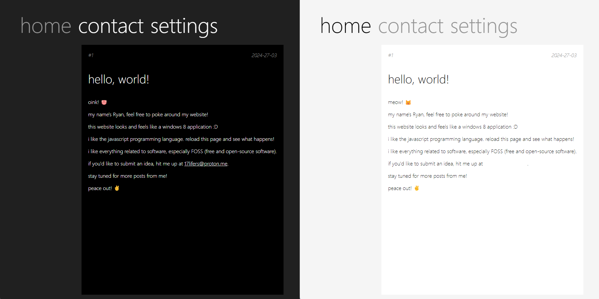

# windows 8 will never die!
a beautiful website made to look like a windows 8 metro interface. 
even though windows 8 was hated by many, its metro design was influential and ahead of its time. it helped the world transition away from skeuomorphism and into flat design.  
do not raise an issue about the text not being capitalized, it is intentional. 
(mac and linux users are welcome to use this website, but it is optimized for windows vista and later, as it uses the segoe ui font.) 
feel free to fork this repository and make use of this unique design in your own projects.
## screenshot

## footnotes
this website is not affiliated with microsoft, windows, or any of their products.
[view the website](https://spetterman66.github.io/)